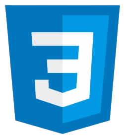
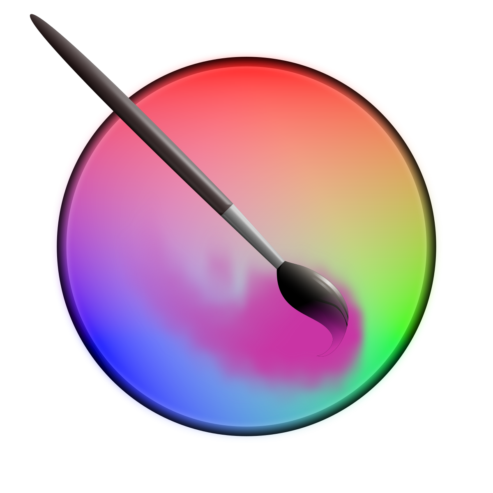
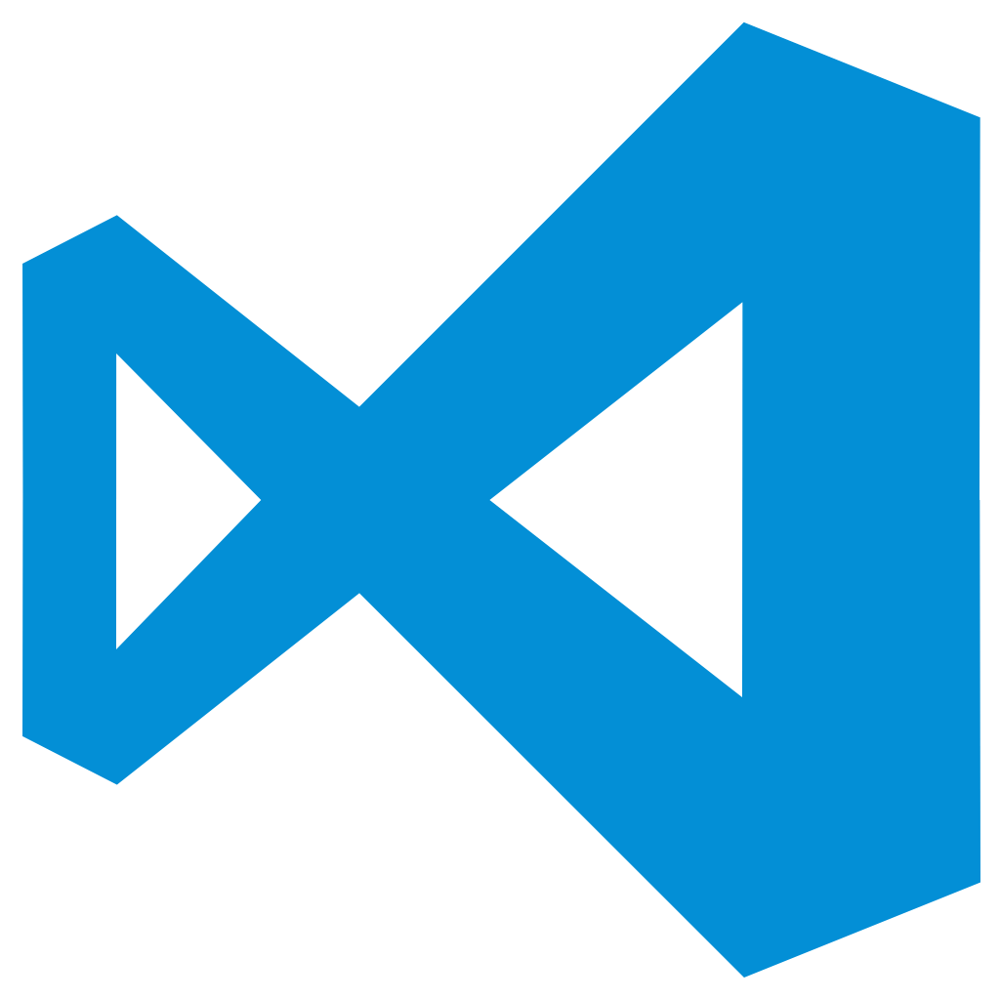
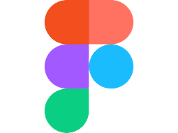
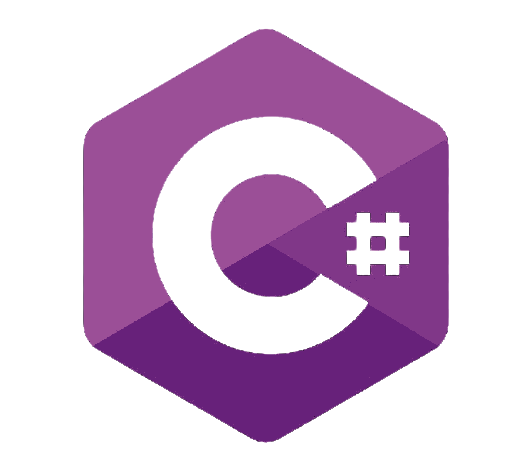

# 

<h1 align="center">Hello there! 👋 I'm Víctor J Chavarría</h1>

I'm a game developer, UX and IU designer, level designer, and programmer, with knowledge in PixelArt, Art, Music, Dubbling.

I'm also an influencer, and SmashBross and BrawlStars ProPrayer.

<h3 align="left">Contact me</h3>

<a href="https://discord.com/users/inztinct_of" target="_blank">
   @inztinct_of
</a>

<a href="mailto:chavarria.martinez.victor101@gmail.com">
   chavarria.martinez.victor101@gmail.com
</a>

<h3 align="left">Tools</h3>

 

<h3 align="left">Informatic languages</h3>

<h3 align="left">Languages</h3>

